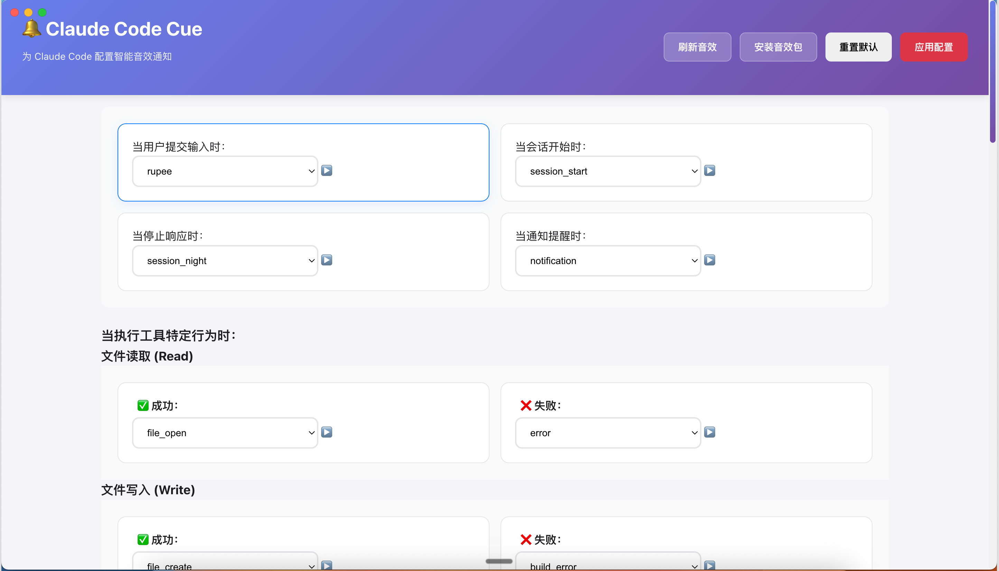

# Claude Code Cue

[](https://github.com/huangxinping/claude_code_cue/actions/workflows/build-and-release.yml)
[](https://github.com/huangxinping/claude_code_cue/actions/workflows/ci.yml)
[](LICENSE)
[](#-下载)

一个为 Claude Code 用户打造的跨平台音效管理 GUI 应用程序。本项目的灵感来源于 [claude-code-but-zelda](https://github.com/linjiw/claude-code-but-zelda) 项目，旨在为 Claude Code 的各种操作添加生动有趣的音效反馈，让编程体验更加愉悦。

----
> 【除了这行】**所有代码均为Vibe Coding，包括 Github Workflows**  
> 【除了这行】**使用 Trae + Claude Code + Sonnet 4，大概Vibe Coding 8小时**  
> 【除了这行】**只测试过 macOS 平台，其他平台未测试**   
> 【除了这行】**温馨提示：建议不要通过”安装音效包“导入苍老师的声音来配置Hook事件音效**   
----

## 📦 下载

### 最新版本

[](https://github.com/huangxinping/claude_code_cue/releases/latest)

| 平台 | 下载链接 | 说明 |
|------|----------|------|
| 🍎 **macOS** | [下载 .dmg](https://github.com/huangxinping/claude_code_cue/releases/latest) | macOS 10.15+ |
| 🪟 **Windows** | [下载 .exe](https://github.com/huangxinping/claude_code_cue/releases/latest) | Windows 10+ |
| 🐧 **Linux** | [下载 .AppImage](https://github.com/huangxinping/claude_code_cue/releases/latest) | Ubuntu 18.04+ |

> 💡 **提示**: 点击上方链接进入 [Releases 页面](https://github.com/huangxinping/claude_code_cue/releases)，选择对应平台的安装包下载。

### 自动化构建

本项目使用 GitHub Actions 实现自动化构建和发布：
- ✅ **自动构建**: 每次发布新版本时自动构建三个平台的安装包
- ✅ **质量保证**: 自动进行类型检查、构建测试和跨平台兼容性测试
- ✅ **即时发布**: 构建完成后自动发布到 GitHub Releases
- ✅ **无需等待**: 无需本地打包，云端构建更快更稳定

## 🎵 项目背景

[claude-code-but-zelda](https://github.com/linjiw/claude-code-but-zelda) 是一个为 Claude Code 添加塞尔达传说音效的项目，它通过 Hook 脚本为不同的工具操作播放相应的音效。虽然功能强大，但配置过程相对复杂，需要手动编辑配置文件和管理音效文件。

**Claude Code Cue** 正是为了解决这个痛点而生：
- 🎯 **简化配置流程**：提供直观的图形界面，无需手动编辑配置文件
- 🔧 **可视化管理**：音效文件的预览、安装、分类管理一目了然
- ⚡ **一键应用**：自动生成 Hook 脚本并同步到 Claude Code
- 🌍 **跨平台支持**：支持 macOS、Windows、Linux 三大平台

## 📸 应用截图

### 🖥️ 主界面



*Claude Code Cue 的主要配置界面，提供直观的音效管理和 Hook 配置功能。界面简洁现代，支持音效预览、工具映射配置和一键应用等核心功能。*

## ✨ 核心功能

### 🎵 音效管理
- **多格式支持**：支持 MP3、WAV、AAC、OGG、M4A 等主流音频格式
- **实时预览**：点击即可试听音效，确保选择合适的音效
- **分类组织**：按类别自动整理音效文件，便于查找和管理
- **批量导入**：支持音效包的批量安装和管理

### ⚙️ Hook 配置
- **全面支持**：覆盖所有 Claude Code Hook 事件（postToolUse、userPromptSubmit、sessionStart、stop 等）
- **工具级配置**：为每个工具（Read、Write、Edit、Bash 等）单独配置成功/失败音效
- **智能映射**：基于 claude-code-but-zelda 的音效映射策略，提供最佳的音效体验
- **即时生效**：配置后立即生成对应的 Python Hook 脚本

### 🖥️ 用户界面
- **现代化设计**：采用 React + TypeScript 构建的现代化界面
- **响应式布局**：适配不同屏幕尺寸，提供一致的用户体验
- **直观操作**：拖拽、点击、预览等交互方式简单易懂
- **实时反馈**：操作状态、错误提示、成功通知等及时反馈

## 🚀 快速开始

### 📦 安装使用

1. **下载应用**：从 [Releases](../../releases) 页面下载适合你系统的安装包
   - macOS: `.dmg` 文件
   - Windows: `.exe` 安装程序
   - Linux: `.AppImage` 可执行文件

2. **安装运行**：双击安装包按提示安装，然后启动 Claude Code Cue

3. **配置音效**：
   - 在界面中为不同的 Hook 事件选择音效
   - 点击预览按钮试听效果
   - 点击"应用配置"按钮生成 Hook 脚本

4. **享受音效**：在 Claude Code 中体验个性化的音效反馈

### 🛠️ 开发环境

如果你想参与开发或自定义构建：

```bash
# 克隆项目
git clone <repository-url>
cd claude-code-cue

# 安装依赖
npm install

# 启动开发环境
npm run dev
# 或使用脚本
./scripts/dev.sh
```

### 🔨 构建打包

```bash
# 运行完整测试
./scripts/test.sh

# 构建项目
./scripts/build.sh

# 打包应用
./scripts/pack.sh        # 当前平台
./scripts/pack.sh all    # 所有平台
```

## 📁 项目结构

```
claude-code-cue/
├── src/
│   ├── main/                    # Electron 主进程
│   │   ├── index.ts            # 主进程入口，窗口管理
│   │   ├── preload.ts          # 预加载脚本，安全的API桥接
│   │   └── services/           # 核心业务服务
│   │       ├── SoundManager.ts # 音效文件管理和播放
│   │       ├── HookManager.ts  # Hook脚本生成和管理
│   │       └── ConfigManager.ts# 配置文件持久化
│   ├── renderer/               # React 渲染进程
│   │   ├── App.tsx            # 主应用组件
│   │   ├── components/        # UI 组件库
│   │   │   ├── SoundSelector.tsx
│   │   │   ├── HookEventList.tsx
│   │   │   └── ToolSoundConfig.tsx
│   │   └── App.css            # 样式文件
│   ├── shared/                # 共享代码
│   │   ├── types.ts           # TypeScript 类型定义
│   │   ├── performance.ts     # 性能优化模块
│   │   └── ux-improvements.ts # 用户体验改进
│   └── assets/
│       └── sounds/            # 内置音效文件
├── scripts/                   # 自动化脚本
│   ├── dev.sh                # 开发环境启动
│   ├── build.sh              # 项目构建
│   ├── test.sh               # 测试执行
│   └── pack.sh               # 应用打包
├── test-*.js                 # 测试文件
├── *.md                      # 文档文件
└── package.json              # 项目配置
```

## 🔔 功能特性

### 音效管理
- ✅ 多格式支持 (MP3, WAV, AAC, OGG)
- ✅ 实时预览功能
- ✅ 音效分类组织
- ✅ 批量安装音效包

### Hook 配置
- ✅ 支持所有 Claude Code Hook 事件
- ✅ 每个 Hook 独立配置
- ✅ 音效启用/禁用控制
- ✅ 自动生成 Hook 脚本

### 用户界面
- ✅ 现代化 Material Design
- ✅ 响应式布局
- ✅ 直观的操作流程
- ✅ 实时状态反馈

### 系统集成
- ✅ Claude Code 自动配置
- ✅ 跨平台音频播放
- ✅ 配置文件同步

## 🏗️ 技术架构

### 🎨 前端技术栈
- **Electron 28**：跨平台桌面应用框架，提供原生应用体验
- **React 18**：现代化的用户界面库，组件化开发
- **TypeScript**：类型安全的 JavaScript，提高代码质量
- **Vite**：快速的构建工具，优化开发体验
- **CSS3**：现代化样式设计，响应式布局

### ⚙️ 核心服务架构
```
┌─────────────────┐    ┌─────────────────┐    ┌─────────────────┐
│   SoundManager  │    │   HookManager   │    │  ConfigManager  │
│                 │    │                 │    │                 │
│ • 音效文件扫描   │    │ • Hook脚本生成   │    │ • 配置持久化     │
│ • 格式验证      │    │ • Python脚本     │    │ • 数据验证      │
│ • 跨平台播放    │    │ • Claude集成     │    │ • 备份恢复      │
└─────────────────┘    └─────────────────┘    └─────────────────┘
```

### 🌍 跨平台音频支持
| 平台 | 播放命令 | 支持格式 | 说明 |
|------|----------|----------|------|
| macOS | `afplay` | MP3, WAV, AAC, M4A | 系统内置音频播放器 |
| Linux | `aplay` | WAV, OGG | ALSA 音频播放器 |
| Windows | PowerShell | MP3, WAV | 使用 .NET Media.SoundPlayer |

## 📊 开发状态

### 已完成 ✅
- [x] 项目架构设计
- [x] UI/UX 设计
- [x] 数据模型设计
- [x] 核心业务逻辑
- [x] 项目脚手架搭建
- [x] 主进程业务逻辑
- [x] 渲染进程 UI 组件
- [x] 音效系统集成

### 进行中 🚧
- [ ] 功能测试
- [ ] 性能优化
- [ ] 用户体验改进

### 待完成 📋
- [ ] 跨平台测试
- [ ] 打包配置优化
- [ ] 发布流程

## 🧪 测试指南

运行完整测试套件：

```bash
./scripts/test.sh
```

测试包括：
- 环境检查
- 依赖验证
- TypeScript 类型检查
- 构建测试
- 文件完整性检查
- 功能模块验证

## 📦 构建和打包

### 本地构建
```bash
./scripts/build.sh
```

### 打包应用
```bash
# 当前平台
./scripts/pack.sh

# 所有平台 (macOS, Windows, Linux)
./scripts/pack.sh all
```

### 输出位置
- **构建输出**: `dist/`
- **打包输出**: `release/`
- **日志文件**: `logs/`

## 🔗 Claude Code 集成

### 📋 工作原理

Claude Code Cue 通过以下方式与 Claude Code 集成：

1. **Hook 脚本生成**：根据你的音效配置，自动生成对应的 Python Hook 脚本
2. **配置文件更新**：自动更新 Claude Code 的 `settings.json` 文件，启用相应的 Hook
3. **音效文件管理**：将音效文件组织到指定目录，确保 Hook 脚本能正确访问

### 📂 文件结构

应用会在以下位置创建和管理文件：

```
~/.claude/
├── settings.json          # Claude Code 主配置文件（自动更新）
└── hooks/                 # Hook 脚本目录（自动生成）
    ├── userPromptSubmit_hook.py
    ├── sessionStart_hook.py
    ├── stop_hook.py
    └── postToolUse_hook.py

~/claude-code-cue-sounds/   # 音效文件目录
├── system/                # 系统音效
├── game/                  # 游戏音效
└── custom/                # 自定义音效
```

### 🎯 使用步骤

1. **启动应用**：打开 Claude Code Cue

2. **配置音效**：
   - 在"简单 Hook 事件"区域为基础事件选择音效
   - 在"PostToolUse 工具配置"区域为具体工具配置成功/失败音效
   - 使用预览功能确保音效符合预期

3. **应用配置**：
   - 点击"应用配置"按钮
   - 应用会自动生成 Hook 脚本并更新 Claude Code 配置
   - 查看通知确认配置是否成功

4. **验证效果**：
   - 在 Claude Code 中执行相应操作
   - 享受个性化的音效反馈

### ⚠️ 注意事项

- **备份配置**：首次使用前，建议备份现有的 `~/.claude/settings.json` 文件
- **权限要求**：确保应用有权限访问和修改 `~/.claude/` 目录
- **Claude Code 版本**：支持最新版本的 Claude Code，建议保持更新

## 🧪 测试

项目包含完整的测试套件，确保功能稳定性：

```bash
# 运行所有测试
npm run test:all

# 运行特定测试
npm run test:core          # 核心逻辑测试
npm run test:integration   # 集成测试
npm run test:e2e          # 端到端测试
```

## ❓ 常见问题

### Q: 音效没有播放怎么办？
A: 请检查：
- 系统音量是否开启
- 音效文件是否存在且格式正确
- Claude Code Hook 是否正确配置

### Q: 支持哪些音效格式？
A: 支持 MP3、WAV、AAC、OGG、M4A 等主流格式，推荐使用 WAV 格式以获得最佳兼容性。

### Q: 如何添加自定义音效？
A: 点击"安装音效包"按钮，选择包含音效文件的文件夹，应用会自动导入并分类。

### Q: 配置会影响现有的 Claude Code 设置吗？
A: 应用只会添加 Hook 相关配置，不会影响其他 Claude Code 设置。建议首次使用前备份配置文件。

## 🤝 贡献指南

我们欢迎各种形式的贡献！

### 🐛 报告问题
- 使用 [Issues](../../issues) 报告 Bug
- 提供详细的复现步骤和环境信息
- 附上相关的日志文件

### 💡 功能建议
- 在 [Issues](../../issues) 中提出新功能建议
- 描述功能的使用场景和预期效果
- 欢迎提供设计草图或原型

### 🔧 代码贡献
1. Fork 本项目
2. 创建功能分支 (`git checkout -b feature/AmazingFeature`)
3. 提交更改 (`git commit -m 'Add some AmazingFeature'`)
4. 推送到分支 (`git push origin feature/AmazingFeature`)
5. 创建 Pull Request

## 📄 许可证

MIT License - 详见 [LICENSE](LICENSE) 文件

## 🙏 致谢

- 感谢 [claude-code-but-zelda](https://github.com/linjiw/claude-code-but-zelda) 项目提供的灵感和音效映射策略
- 感谢所有贡献者和用户的支持

---

**Claude Code Cue** - 让你的 Claude Code 体验更加生动有趣！ 🎵✨

如果这个项目对你有帮助，请给个 ⭐ Star 支持一下！